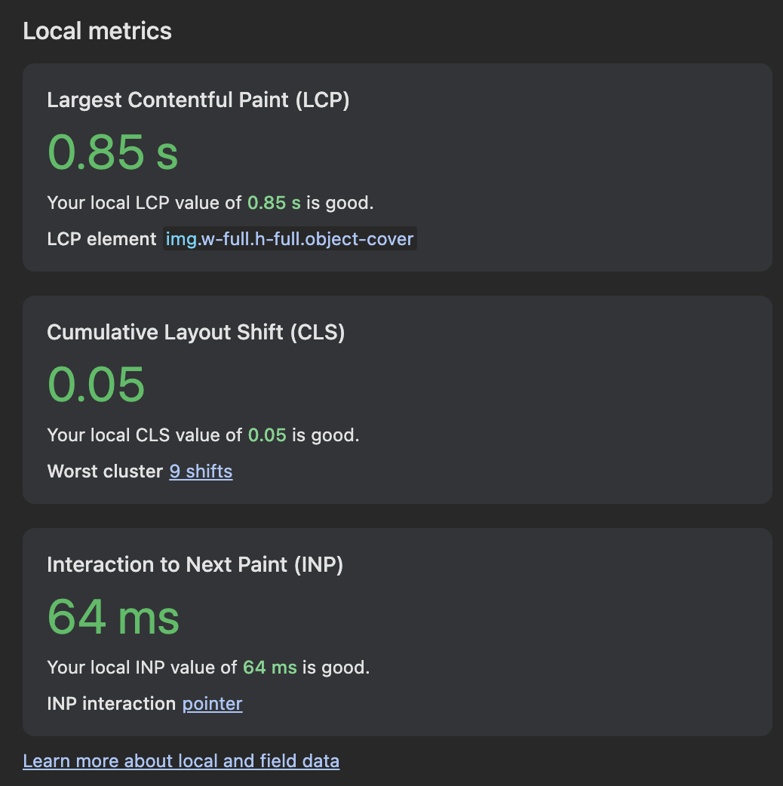

# Frontend Challenge

<br/>

[](https://www.typescriptlang.org/)
[](https://nuxt.com/)
[](https://tailwindcss.com/)


# Code structure

I followed [Nuxt.js](https://nuxt.com/docs/guide/directory-structure/nuxt) guide to organize my folder structure and code
**except** wrapping everything inside a `src/` folder to keep the root clean and seperate main files from congigaration files.

```
frontend-challenge/
├── src/
│   ├── components/       # Reusable UI components
│   ├── composables/      # Reusable logic & hooks
│   ├── layouts/          # App layouts
│   ├── pages/            # Nuxt pages (routes)
│   ├── services/         # API services
│   ├── stores/           # state management stores & data preprocessing
│   ├── utils/            # Utility functions, constants and TypeScript types
│   ├── app.vue           # Root Vue component
│   ├── server/           # SSR endpoints fetch
│   └── assets/           # Images, fonts, global styles, and other assets
├── .gitignore
├── package.json
├── tsconfig.json
└── README.md
└── nuxt.config.ts    # Nuxt configuration
└── ...Other root files for Nuxt js configuration...
```

<br/>
<br/>

# Implementation Notes

## DTO (Data Transfer Object) approch

Since the data returned from the API is not always the same especially for nested data, I used DTOs to define the data structure and preprocess it.
This allows me to have a clear contract for the data I expect from the API and handle any changes in the API response wit the minimum changes in frontend code.

### Example of DTO (in `src/stores/products/DTO/products.ts`)

```typescript
export const ProductsDTOBuilder = (wrapper: Product[]): ProductDTO[] => {
  return wrapper?.map(
    (product: Product): ProductDTO => ({
      title: product?.title || "No Title",
      price: Number(product?.price?.value)?.toLocaleString() || "0",
      //...other fields preprocessing...
    })
  );
};
```

## Lazy loading with nested data

Since API data is in this structure:

```json
{
  "content":[
    [
      {"type":"products","content":[...]},
      {"type":"grid","content":[...]},
      {"type":"products","content":[...]},
    ]
  ]
}
```

We need to make a lazy loading for both the main "content" objects and the inner "content" objects.
To achieve this, I created a composable function `useLazyScroll` that simulate the lazy loading logic for any given data.

### Example of using lazy loading composable

```typescript
const {
  displayedData: lazyProducts,
  hasMore,
  isLoading, 
  endTracker, // ref for the end of the list to track scroll
} = useLazyScroll(data, {
  initialCount: 20, // initial number of items to display
  increment: 20, // number of items to load on each scroll
});
```

## Multiple states handling in one wrapper component example

```html
<WrapperComponent
  :card-skeleton="true"
  :is-loading="isLoading"
  :is-pending="isPending"
  :is-success="isSuccess"
  :error="error"
  :is-online="isOnline"
  :is-empty="isDataEmpty"
>
  <template #content>Your main content goes here</template>
</WrapperComponent>
```

# Metric



# Development Setup

1. Clone the repository

```shell
git clone https://github.com/Aya-Jafar/Frontend-Challenge.git
```

2. Install dependencies

```shell
npm install
```

3. Run development server

```shell
npm run dev
```

Happy coding! 🚀
